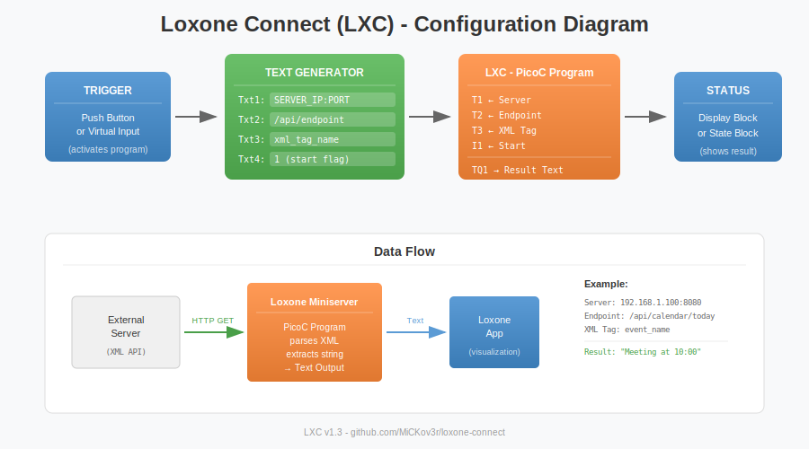
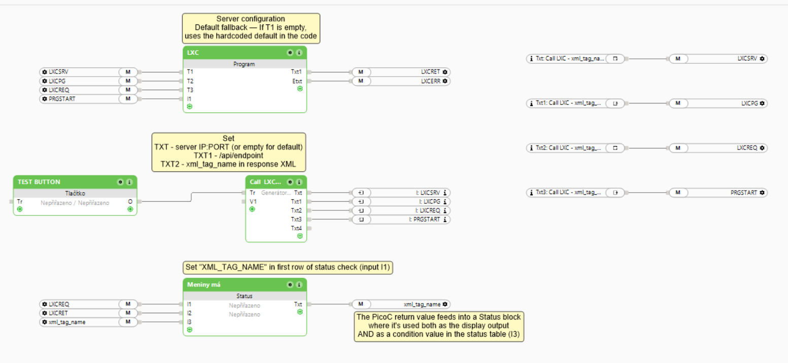

# Loxone Connect (LXC)

**Get string values into Loxone Miniserver via HTTP/XML — a feature Loxone doesn't natively support.**

## The Problem

Loxone Miniserver natively supports receiving numeric values via HTTP, but **cannot receive string/text values**. This is a significant limitation when you need to:

- Display text from external APIs
- Show status messages from smart home devices
- Integrate text-based data from third-party services

## The Solution

This PicoC program runs directly on your Loxone Miniserver and:

1. Fetches data from any HTTP endpoint
2. Parses XML response
3. Extracts string values
4. Makes them available as text outputs in Loxone Config




## Installation

1. Open **Loxone Config**
2. Create a new **PicoC Program Block**
3. Copy the code from `lxc.c` into the program block
4. Configure your inputs and outputs
5. Save and deploy to Miniserver


## Configuration

### Inputs

| Input | Type | Description |
|-------|------|-------------|
| AI 1 | Analog | Trigger (value > 0 activates the program) |
| TI 1 | Text | Server address (optional - uses default if empty) |
| TI 2 | Text | HTTP endpoint path/command |
| TI 3 | Text | XML tag name to extract |

### Outputs

| Output | Type | Description |
|--------|------|-------------|
| TQ 1 | Text | Extracted string value |

### Server Configuration

You can configure the server in two ways:

1. **Via TI 1 input** — Set server address dynamically (e.g., `192.168.1.100:8080`)
2. **Default fallback** — If TI 1 is empty, uses the hardcoded default in the code

To change the default server, modify this line:

```c
val = httpget("YOUR_SERVER_IP:PORT", t2);
```

## Recommended Loxone Config Setup

For the cleanest configuration, use a **Text Generator** block:

| Text Generator | Value | Connects to |
|----------------|-------|-------------|
| Txt  | Server IP:PORT (or empty for default) | T1 |
| Txt1 | /api/endpoint | T2 |
| Txt2 | xml_tag_name | T3 |
| Txt3 | 1 | I1 (trigger) |

This approach:
- Keeps all configuration in one place
- Easy to switch between different API endpoints
- No need for multiple Memory blocks

## How It Works

```
┌─────────────┐     HTTP GET      ┌─────────────┐
│   Loxone    │ ────────────────► │   External  │
│  Miniserver │                   │   Server    │
│   (PicoC)   │ ◄──────────────── │   (XML)     │
└─────────────┘    XML Response   └─────────────┘
       │
       ▼
  Extract string
  from XML tag
       │
       ▼
  Text Output
  (available in
  Loxone Config)
```

## Example Use Cases

- **Weather**: Display current weather conditions as text
- **Calendar**: Show next appointment name
- **Media**: Display currently playing song title
- **Notifications**: Show alert messages from external systems
- **Integration**: Any API that returns XML data

## Requirements

- Loxone Miniserver (Gen 1 or Gen 2)
- Loxone Config software
- External server providing XML responses

## Error Handling

The program includes built-in error handling:

- `"HTTP error"` — Failed to connect to server or fetch data
- `"XML error"` — XML parsing failed or tag not found
- Empty string — Program not triggered (input ≤ 0)

## Polling Interval

Default polling interval is **1000ms** (1 second). Adjust the `sleep()` value to change.

## Contributing

Pull requests welcome! Please open an issue first to discuss proposed changes.

---

**Note**: This is an unofficial community project and is not affiliated with Loxone Electronics GmbH.
